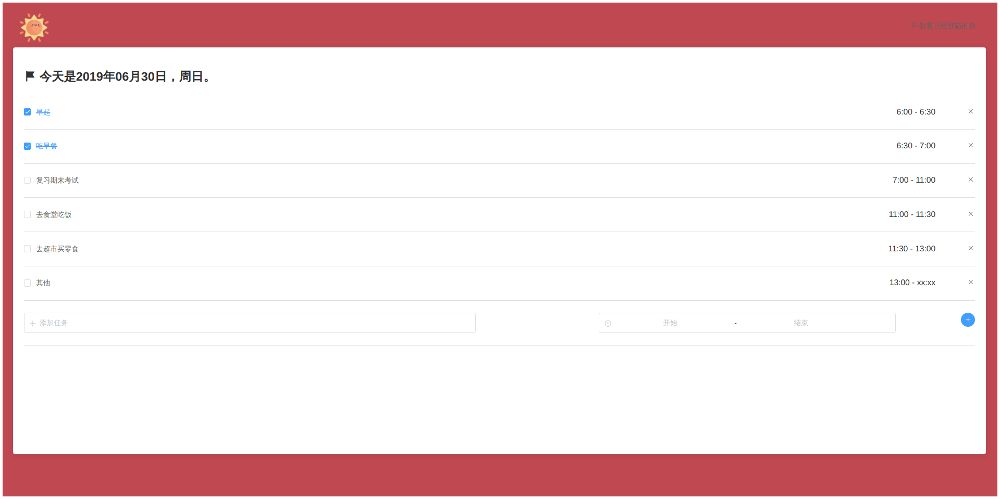
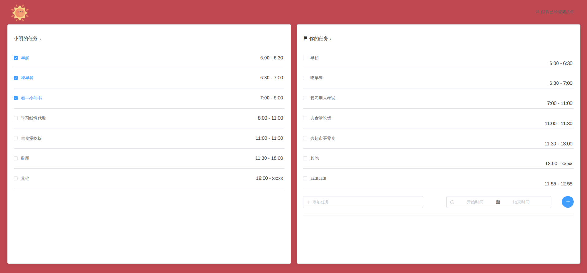

## To Do Together

本项目旨在以单人或多人模式操作任务，所有任务将以日期保存，用户可以选择某些任务定时循环。

用户创建组之后，组内成员可以查看各自的任务，互相监督，但是不可编辑组内其他用户的任务。用户可以选择某些任务对组不可见，以尊重用户的隐私。也可以选择某些用户可以共同完成。

This project is designed to operate in single or multiplayer mode, all tasks will be saved by date, and the user can select certain task timed loops.

After a user creates a group, members of the group can view their respective tasks and supervise each other, but cannot edit the tasks of other users in the group. Users can choose certain tasks to be invisible to the group to respect the privacy of the user. You can also choose some users to do it together.

### 截图

### To Do

- [x] 单人模式前端页面
- [ ] 多人模式前端页面
- [ ] 用户认证功能
- [ ] 任务添加额外功能
- [ ] 后端相关任务功能
- [ ] 以日期为单位查看历史任务
- [ ] 单个任务循环
- [ ] 多人模式下任务循环
- [ ] 多人模式下任务共享
- [ ] 多人模式下权限管理
- [ ] ...